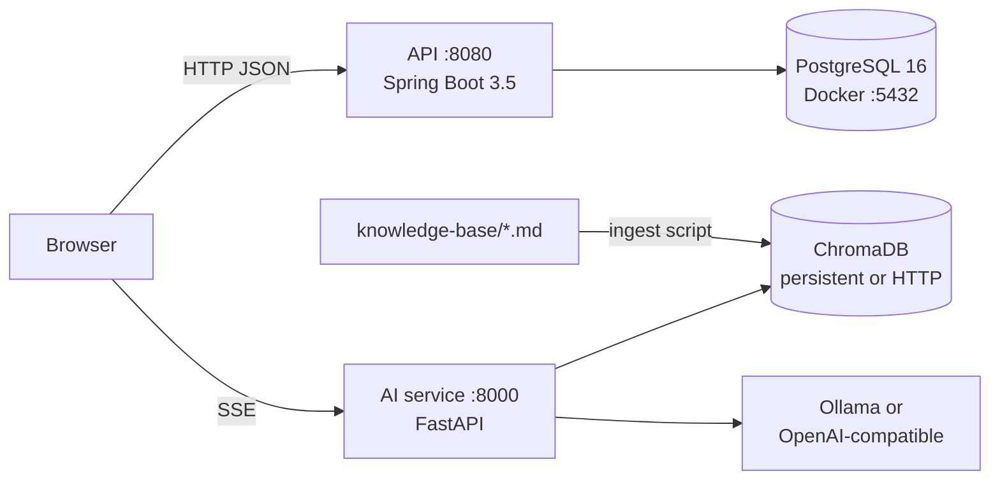

# Design: Amber & Pea Law Website

## Overview

Monorepo with three independently runnable services and a knowledge base. PostgreSQL is the only containerized component in local dev.



```
/
├── docker-compose.dev.yml      PostgreSQL 16 only (dev)
├── .env.example                DB name/user/password for compose
├── api/                        Java 17, Spring Boot, Maven Wrapper
├── ai-service/                 Python 3.11+, FastAPI
├── knowledge-base/             markdown + ingest.py
├── frontend/                   React + Vite + TypeScript
└── README.md
```

### Ports and URLs (all env-configurable)

| Service | Default port | Key env vars |
|---|---|---|
| PostgreSQL | 5432 | `POSTGRES_DB`, `POSTGRES_USER`, `POSTGRES_PASSWORD` |
| API | 8080 | `SERVER_PORT`, `DB_URL`, `DB_USERNAME`, `DB_PASSWORD`, `CORS_ALLOWED_ORIGINS`, `JWT_SECRET`, `ADMIN_EMAIL`, `ADMIN_PASSWORD` |
| AI service | 8000 | `PORT`, `LLM_PROVIDER`, `LLM_BASE_URL`, `LLM_MODEL`, `EMBEDDING_*`, `CHROMA_MODE`, `CORS_ALLOWED_ORIGINS` |
| Frontend | 5173 | `VITE_API_BASE_URL`, `VITE_AI_BASE_URL`, `VITE_SITE_URL` |

### Versions (pinned)

- Java 17, Spring Boot 3.5.16 (BOM pins Spring, Hibernate, Flyway, PostgreSQL driver, Testcontainers), Maven 3.9.16 via Maven Wrapper 3.3.4.
- Python: fastapi 0.142.2, uvicorn 0.54.0, chromadb 1.5.9, rank-bm25 0.2.2, httpx 0.28.1, pydantic-settings 2.15.0, pytest 9.1.1.
- Frontend: react 19.3.0, react-router-dom 7.18.4, vite 8.3.2, vitest 5.0.3 (exact versions in `package.json`, no ranges).

Note: Spring Boot 3.5 open-source support ended 30 June 2026. 3.5.16 is the latest 3.x release and is used as requested. Spring Boot 4.x also runs on Java 17 and is the upgrade path.

## API (Spring Boot)

### Package layout (`com.amberpea.law`)

- `config` – typed `@ConfigurationProperties` (`app.cors`, `app.booking`, `app.security`, `app.rate-limit`), CORS, Jackson.
- `security` – `SecurityConfig`, JWT encoder/decoder (HS256, secret from env), `AuthController`, `AdminBootstrap` (creates first admin when table is empty).
- `common` – `ApiExceptionHandler` (RFC 7807 `ProblemDetail`), `RateLimitFilter`, `ClientIp` helper.
- `practicearea`, `attorney`, `review`, `lead`, `booking`, `notification` – entity, repository, service, DTOs, controllers (public + admin).

JPA with Spring Data repositories (parameterized by construction); `spring.jpa.hibernate.ddl-auto=validate`; `open-in-view=false`.

### Data model (Flyway)

```mermaid
erDiagram
  practice_area ||--o{ attorney_practice_area : ""
  attorney ||--o{ attorney_practice_area : ""
  practice_area ||--o{ review : "optional"
  practice_area ||--o{ lead : "optional"
  lead ||--o| booking : ""
  practice_area { bigint id PK; varchar slug UK; varchar name; text summary; text description; int sort_order; bool active }
  attorney { bigint id PK; varchar slug UK; varchar full_name; varchar title; text bio; varchar photo_url; text education; text bar_admissions; int sort_order; bool active }
  review { bigint id PK; varchar author_name; smallint rating; text content; bigint practice_area_id FK; date review_date; bool published }
  lead { bigint id PK; varchar full_name; varchar email; varchar phone; text message; bigint practice_area_id FK; varchar source; varchar status; bool consent; timestamptz created_at }
  booking { bigint id PK; bigint lead_id FK; timestamptz start_at; timestamptz end_at; varchar status }
  admin_user { bigint id PK; varchar email UK; varchar password_hash; varchar display_name }
```

Constraints:
- `lead.source IN ('CONSULTATION_FORM','CONTACT_FORM','CHATBOT','BOOKING')`, `lead.status IN ('NEW','CONTACTED','BOOKED','CLOSED')`, `CHECK (consent)`.
- `booking.status IN ('NEW','CONTACTED','BOOKED','CLOSED','CANCELLED')`, `CHECK (end_at > start_at)`.
- No double booking: `EXCLUDE USING gist (tstzrange(start_at, end_at, '[)') WITH &&) WHERE (status <> 'CANCELLED')`, named `booking_no_overlap`. The service maps a violation to HTTP 409.
- `review.rating BETWEEN 1 AND 5`.

Migrations: `V1__schema.sql`, `V2__seed_sample_content.sql`. Admin user is not seeded by SQL; it comes from env at startup.

### Endpoints

Public:
- `GET /api/practice-areas`, `GET /api/practice-areas/{slug}`
- `GET /api/attorneys`, `GET /api/attorneys/{slug}`
- `GET /api/reviews?limit=` (published only)
- `POST /api/leads` – consultation/contact/chatbot lead (rate-limited, honeypot `website`)
- `GET /api/bookings/availability?date=YYYY-MM-DD` – slots for a date plus booking window
- `POST /api/bookings` – creates lead (source BOOKING) + booking (rate-limited, honeypot)
- `POST /api/auth/login` – returns `{ token, expiresAt }` (rate-limited)

Admin (`ROLE_ADMIN`, Bearer JWT):
- `GET /api/auth/me`
- `GET /api/admin/leads?status=&source=&q=&page=&size=`, `PATCH /api/admin/leads/{id}/status`
- `GET /api/admin/bookings?status=&from=&to=&page=&size=`, `PATCH /api/admin/bookings/{id}/status`
- `GET|POST /api/admin/reviews`, `PUT /api/admin/reviews/{id}`
- `GET|POST /api/admin/practice-areas`, `PUT /api/admin/practice-areas/{id}`

Ops: `/actuator/health/liveness`, `/actuator/health/readiness` (readiness includes DB).

### Security

- Stateless: `SessionCreationPolicy.STATELESS`, CSRF disabled (no cookies used for auth), JWT HS256 via Spring Security OAuth2 Resource Server and `NimbusJwtEncoder`. `JWT_SECRET` must be ≥ 32 bytes; startup fails otherwise.
- Passwords: `BCryptPasswordEncoder` (strength 12).
- CORS: `CORS_ALLOWED_ORIGINS` comma-separated, no wildcards.
- Rate limiting: in-memory fixed-window per client IP and route group (forms, login). Suitable for one instance; for multiple replicas it should move to a shared store (Redis) or the ingress. `X-Forwarded-For` is trusted only when `app.rate-limit.trust-forwarded-headers=true`.
- Validation: Jakarta Bean Validation on DTOs; errors returned as `ProblemDetail` with field errors.
- Honeypot: non-empty `website` field → respond 202 with a fake id-less body and do not persist.

### Booking logic

`app.booking` properties: `timezone` (default `America/Chicago`), `business-days` (MON–FRI), `open` (09:00), `close` (17:00), `slot-minutes` (30), `min-notice-hours` (2), `max-days-ahead` (30). Availability = generated slots for the date in the firm timezone minus slots overlapping non-cancelled bookings minus slots inside the minimum notice. `POST /api/bookings` re-validates that `startAt` is a generated slot, then inserts; the exclusion constraint resolves races.

`NotificationService` interface with `LoggingNotificationService` stub (logs booking id and time, never PII).

## AI service (FastAPI)

### Modules (`app/`)

- `config.py` – `pydantic-settings` `Settings` from env.
- `llm.py` – `LLMClient` protocol; `OllamaClient` (`/api/chat` streaming NDJSON) and `OpenAICompatClient` (`/v1/chat/completions` SSE). Selected by `LLM_PROVIDER=ollama|openai`.
- `embeddings.py` – `OllamaEmbeddings` (`/api/embed`) or `OpenAICompatEmbeddings` (`/v1/embeddings`), selected by `EMBEDDING_PROVIDER`.
- `vector_store.py` – Chroma client factory: `CHROMA_MODE=persistent` → `PersistentClient(path)`, `http` → `HttpClient(host, port, ssl)`. Embeddings are computed by the service and passed explicitly.
- `chunking.py` – splits markdown by headings into ~800-char chunks with front-matter metadata (`title`, `source`, `url`).
- `retrieval.py` – `HybridRetriever`: vector top-k + BM25 top-k (BM25 index built at startup from the collection's documents, so the service stays stateless) → Reciprocal Rank Fusion (k=60) → top-n. A relevance gate requires at least one hit with BM25 score > 0 or vector distance under a threshold.
- `guardrails.py` – deterministic detection of legal-advice / outcome-prediction requests and contact intent; produces a fixed disclaimer and a `suggest_booking` flag.
- `prompts.py` – system prompt: answer only from context, cite `[n]`, no legal advice, no outcome promises, offer consultation.
- `chat.py` – orchestrates guardrails → retrieval → prompt → streamed tokens.
- `rate_limit.py` – in-memory sliding window per IP.
- `main.py` – app, CORS, routes, structured stdout logging.
- `ingest.py` – reads `knowledge-base/*.md`, chunks, embeds, upserts (recreates collection).

### Endpoints

- `POST /chat/stream` – body `{ message, history[] }` (validated lengths). Response `text/event-stream` with events: `meta` (`{citations, suggest_booking, suggest_contact}`), `token` (`{text}`), `done`, `error`.
- `GET /health/live`, `GET /health/ready` (ready = collection reachable and non-empty).

`knowledge-base/ingest.py` is a thin wrapper that runs `app.ingest` using the ai-service virtualenv.

## Frontend (React + Vite + TS)

- `src/config.ts` reads `import.meta.env.VITE_*` (build-time). For containers later, these can be swapped for a runtime `config.js`.
- `src/api/` typed fetch client (`apiClient.ts`), `chatClient.ts` (SSE over `fetch` + `ReadableStream`, since `EventSource` can't POST).
- Routing (`react-router-dom`): `/`, `/practice-areas`, `/practice-areas/:slug`, `/attorneys`, `/attorneys/:slug`, `/reviews`, `/book`, `/contact`, `/disclaimer`, `/privacy`, `/admin/login`, `/admin/*`. Pages are lazy-loaded with `React.lazy`.
- Components: `Layout` (skip link, header nav, footer disclaimer, `ChatWidget`), `ConsultationForm`, `ContactForm`, `StarRating`, `SlotPicker`, `Seo` (sets title/meta/canonical), `LegalServiceJsonLd`.
- Admin: token in `sessionStorage`, `RequireAuth` guard, pages for leads, bookings, reviews, practice areas.
- Styling: plain CSS with custom properties; contrast-checked palette (amber accent on dark navy text), visible `:focus-visible` outlines, mobile-first breakpoints, `loading="lazy"` images with width/height.
- SEO: `public/robots.txt`, `public/sitemap.xml`, JSON-LD `LegalService` in `index.html`.

## Error handling

- API: `ProblemDetail` for 400 (validation), 401, 403, 404, 409 (slot taken), 429, 500 (generic message, details only in logs).
- AI: SSE `error` event with a generic message; widget shows fallback with phone and booking link. Network failure to the AI service triggers the same fallback.

## Testing strategy

- API: JUnit 5 unit tests (slot generation, honeypot), Spring Boot integration tests with Testcontainers PostgreSQL 16 (migrations, double-booking 409, admin auth 401/200, lead persistence).
- AI: pytest for chunking, RRF, guardrails, relevance gate, SSE endpoint with fake LLM/embeddings.
- Frontend: Vitest + Testing Library for `StarRating`, `ConsultationForm` validation, `ChatWidget` fallback.
