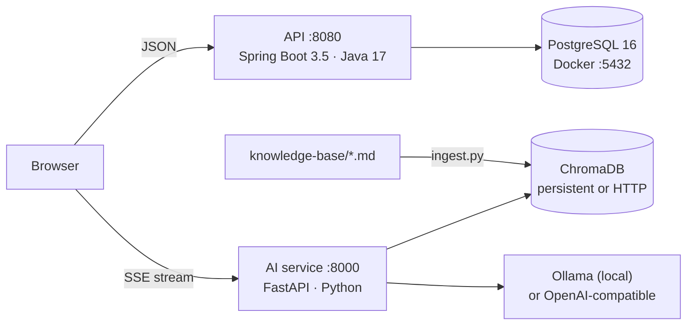

# Amber & Pea Law: AI-powered law firm website (portfolio project)

A complete website for a service business: marketing pages, a hybrid-RAG chatbot that answers from the firm's own content, online consultation booking, lead capture and an admin dashboard.

> **Sample content.** Amber & Pea Law is a fictional firm. All names, attorneys, reviews, addresses and phone numbers are invented.



| Folder | Stack |
|---|---|
| `api/` | Java 17, Spring Boot 3.5.16, Spring Security (JWT), JPA, Flyway, PostgreSQL 16, Maven Wrapper |
| `ai-service/` | Python 3.13, FastAPI, ChromaDB, BM25 (`rank-bm25`), Reciprocal Rank Fusion, Ollama / OpenAI-compatible |
| `knowledge-base/` | Markdown the chatbot answers from, plus `ingest.py` |
| `frontend/` | React 19, TypeScript 6, Vite 8, React Router 7 |
| `docker-compose.dev.yml` | PostgreSQL 16 only (local development) |

The spec (requirements, design, tasks) is in `.kiro/specs/amber-pea-law-website/`.

## Features

- **Pages:** home (click-to-call and a short consultation form above the fold), practice areas, attorney bios, reviews with star ratings, booking, contact, disclaimer and privacy pages.
- **AI chatbot** on every page:
  - Answers only from the knowledge base and cites its sources.
  - Streams replies.
  - Never gives legal advice or predicts outcomes (fixed guardrail replies plus a relevance check).
  - Offers to book a consultation or take contact details, but only collects them after a consent checkbox.
  - Falls back to a friendly message when the service is down.
- **Booking:**
  - Business hours, slot length, notice and booking window all come from configuration.
  - **Double booking is prevented by a PostgreSQL exclusion constraint**, and a lost race returns HTTP 409.
  - Confirmation screen afterwards; the email notification is a logging stub.
- **Lead capture:** every form saves a lead with its source (`CONSULTATION_FORM`, `CONTACT_FORM`, `CHATBOT`, `BOOKING`). Consent is required, and a hidden spam-trap field (honeypot) filters bots.
- **Admin (`/admin`):**
  - Login with bcrypt passwords and JWT; the first admin is created from env variables.
  - Filter leads and bookings and update their status (cancelling a booking frees the slot).
  - Add and edit reviews and practice areas.
- **Quality:**
  - Validation on both frontend and backend, with parameterized queries only.
  - Per-IP rate limits, and CORS limited to configured origins.
  - Accessibility aims for WCAG 2.1 AA.
  - SEO meta tags on every page, a sitemap, `robots.txt` and schema.org `LegalService` JSON-LD.

## Prerequisites (Windows)

- Docker Desktop (PostgreSQL and the API integration tests)
- JDK 17. Maven is not needed; `mvnw.cmd` downloads it.
- Node.js 22.12+ (tested with 24)
- Python 3.11+ (tested with 3.13)
- Ollama, with `ollama pull nomic-embed-text` and `ollama pull llama3.2:1b` (or a larger chat model)

## Run locally

Use four terminals from the repo root.

### 1. PostgreSQL (Docker)

```powershell
Copy-Item .env.example .env          # set POSTGRES_PASSWORD
docker compose -f docker-compose.dev.yml up -d
docker inspect --format "{{.State.Health.Status}}" amber-pea-postgres   # wait for "healthy"
```

If port 5432 is taken, set `POSTGRES_PORT` in `.env` and use the same port in `api/.env` → `DB_URL`.

### 2. API (http://localhost:8080)

```powershell
cd api
Copy-Item .env.example .env          # DB_PASSWORD (same as root .env), JWT_SECRET (32+ bytes), ADMIN_EMAIL, ADMIN_PASSWORD
.\mvnw.cmd spring-boot:run
```

On startup Flyway creates the schema and sample content. If no admin exists, one is created from `ADMIN_EMAIL` / `ADMIN_PASSWORD` (minimum 12 characters). `api/.env` is imported for local runs only; real environment variables override it.

### 3. AI service (http://localhost:8000)

```powershell
cd ai-service
python -m venv .venv
.venv\Scripts\python -m pip install -r requirements-dev.txt
Copy-Item .env.example .env
cd ..
ai-service\.venv\Scripts\python knowledge-base\ingest.py    # index the knowledge base (re-run after edits)
cd ai-service
.venv\Scripts\python -m app.main
```

### 4. Frontend (http://localhost:5173)

```powershell
cd frontend
Copy-Item .env.example .env.local
npm ci
npm run dev
```

Admin dashboard: http://localhost:5173/admin. To show your admin login: `Get-Content api\.env | Select-String '^ADMIN_'`.

## Tests

| Suite | Command | What it covers |
|---|---|---|
| API unit | `cd api; .\mvnw.cmd test` | Slot rules (business days, notice, window, daylight saving), config validation, client-IP handling, rate-limit grouping |
| API integration | `cd api; .\mvnw.cmd verify` | Runs against **PostgreSQL 16 in Testcontainers** (Docker must be running): migrations and seed data, CORS, leads (consent, honeypot, validation, SQL injection stored as text), booking (409, 8 concurrent requests → exactly 1 booking, database constraint, invalid times), admin auth (401, forged JWT, bcrypt), admin filters and edits, rate limiting |
| AI service | `cd ai-service; .venv\Scripts\python -m pytest` | Chunking, tokenizer, RRF, hybrid search, BM25-only fallback, guardrails, chat orchestration with a fake LLM (citations, disclaimers, no-LLM mode, LLM-down fallback), SSE endpoint, validation, rate limit, CORS, no internal error leakage |
| Frontend | `cd frontend; npm test` | Vitest + Testing Library: `StarRating`, `LeadForm` validation and submission, `ChatWidget` (streaming, citations, fallback, 429, consent-gated lead), `SlotPicker` |

Integration tests use their own throwaway database and never read `api/.env`.

## Configuration

Every setting comes from environment variables; each service has its own `.env.example`.

- **API:** `DB_*`, `CORS_ALLOWED_ORIGINS`, `JWT_*`, `ADMIN_*`, `RATE_LIMIT_*`, `BOOKING_*` (timezone, business days, open/close, slot minutes, minimum notice, days ahead).
- **AI service:**
  - `LLM_PROVIDER`: `ollama`, `openai` (any compatible API through `LLM_BASE_URL` + `LLM_API_KEY`), or `none` (no LLM; replies with the best-matching passage).
  - `EMBEDDING_PROVIDER`: `ollama`, `openai`, or `default` (Chroma's built-in local model).
  - `CHROMA_MODE`: `persistent` (local folder) or `http` (a Chroma server).
  - Retrieval thresholds.
- **Frontend:** `VITE_API_BASE_URL`, `VITE_AI_BASE_URL`, `VITE_SITE_URL`. These are baked in at build time.

`llama3.2:1b` is fast but sometimes adds details that aren't in the context. `llama3.2:3b` or larger gives more faithful answers.

## How the chatbot answers

1. **Guardrails, before any model runs.** Greetings, emergencies (911 / 988) and outcome questions ("will I win", "what's my case worth") get fixed replies. Advice questions always start with a no-legal-advice disclaimer.
2. **Hybrid retrieval.** ChromaDB vector search and BM25 keyword search run side by side, merged with Reciprocal Rank Fusion. The BM25 index is built from the Chroma collection at startup, so the service stays stateless.
3. **Relevance check.** If nothing matches well, the bot says it doesn't have that information and offers a consultation.
4. **Answer.** The LLM writes a short answer from the retrieved passages only, with `[n]` citations, streamed over Server-Sent Events.
5. **Fallbacks.** LLM down → best passage. Embeddings down → keyword search only. Whole service down → the widget shows the phone number and a booking link.

## API endpoints

Public:
- `GET /api/practice-areas[/{slug}]`, `GET /api/attorneys[/{slug}]`, `GET /api/reviews?limit=`
- `POST /api/leads`
- `GET /api/bookings/config`, `GET /api/bookings/availability?date=`, `POST /api/bookings`
- `POST /api/auth/login`
- `GET /actuator/health/liveness`, `GET /actuator/health/readiness`

Admin (Bearer JWT):
- `GET /api/auth/me`
- `GET /api/admin/leads`, `PATCH /api/admin/leads/{id}/status`
- `GET /api/admin/bookings`, `PATCH /api/admin/bookings/{id}/status`
- `GET|POST /api/admin/reviews`, `PUT /api/admin/reviews/{id}`
- `GET|POST /api/admin/practice-areas`, `PUT /api/admin/practice-areas/{id}`

AI service: `POST /chat/stream`, `GET /health/live`, `GET /health/ready`, plus API docs at `/docs`.

## Accessibility and performance

Measured on the production build in headless Edge:

- **axe-core** (WCAG 2.0/2.1 A and AA plus best-practice rules): **0 violations**. That covers every public page at 1280px and 390px, the booking form with validation errors, the open chat panel, and all admin pages including the editors.
- **Lighthouse mobile:** Performance **97–99**, Accessibility **100**, Best Practices **100**, SEO **100** on all public pages. CLS is 0 and LCP is about 2 seconds.

Automated tools can't confirm full WCAG compliance. That still needs manual testing with screen readers and keyboard-only use, and an accessibility review.

## Security notes and known limits

- **Rate limiting:** counts are kept in memory for each instance. With several replicas, move them to a shared store (for example Redis) or rate-limit at the ingress. `X-Forwarded-For` is only trusted when `RATE_LIMIT_TRUST_FORWARDED=true`.
- **Admin tokens:** short-lived HS256 JWTs stored in `sessionStorage` and sent as a Bearer header, so there are no cookies and no CSRF exposure. Sign-out clears the token on the client; there is no server-side revocation list.
- **Booking notifications:** a logging stub (it logs no personal data). Implement `NotificationService` to send real email.
- **Spring Boot 3.5:** open-source support ended on 30 June 2026. 3.5.16 is used as requested; Spring Boot 4.x also runs on Java 17 and is the upgrade path.
- **Deployment:** no Dockerfiles, Kubernetes or Terraform are included yet. The services are stateless, log to stdout, take all config from env and expose health probes, so they're ready for containers.

## Stop / reset

```powershell
docker compose -f docker-compose.dev.yml down        # stop, keep data
docker compose -f docker-compose.dev.yml down -v     # stop and delete the database volume
```
